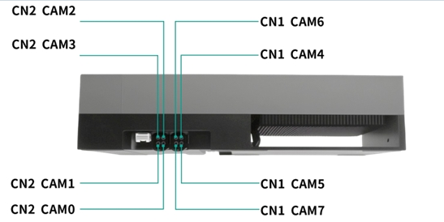
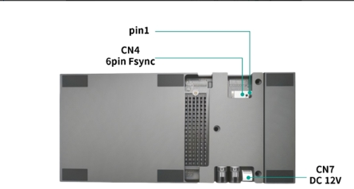

#### IGX version

*  IGX2.0 SW 

#### Supported Camera Modules
```
Camera Model               Resolution         Output     Interface   MaxDevices  Frame Sync
S56C                       2560*1984V         RAW10      GMSL2-6G        1          MFP7          
SHW5G                      2560*1984V         RAW10      GMSL2-6G        2          MFP7
SHF3L                      1920*1536V         YUV422     GMSL2-6G        2          MFP7
```

#### Quick Bring Up

1. Flashing:

   Since CAM0_PWDN and CAM1_PWDN are occupied in the original firmware and their GPIO functions are not enabled, the firmware needs to be modified and then re-flashed to the device.

   Copy the files from the driver package (ITRD1_G2A_IGX_THOR_GMSL2x4_IGX2.0_L4TR38.5.0/source/Linux_for_Tegra/) and overwrite the corresponding files in your BSP package (<work_path>/Linux_for_Tegra/bootloader/)

2. Connect the Camera to the ports on the adapter board.

   2.1 Support the following two combinations:

   Combination 1
   ```
   S56C x 1 + SHF3L x 2 
   ```
   Combination 2
   ```
   
   S56C x 1 + SHW5G x 2
   ```
   2.2 CAM Port to Device Node Mapping

   

   The correspondence between CAM ports and device nodes is as follows:

    ```
    PORT                    DeviceTree Node          DEV NODE                                  
    CN1(CAM4)               cam_0                    /dev/video0                 
    CN1(CAM5)               cam_1                    /dev/video1                 
    CN1(CAM6)               cam_2                    /dev/video2 
    CN1(CAM7)               cam_3                    /dev/video3                 
    ```  
   2.3 Connect the Camera to the ports on the adapter board.

   S56: CAM4

   SHF3L: CAM6/CAM7

   SHW5G: CAM6/CAM7

   Note:The S56 stereo camera occupies two video nodes (video0 and video1), so no camera can be connected to CAM5.

3. Copy the driver package to the working directory of the IGX_THOR device, such as “/home/nvidia”

   ```
   /home/nvidia/ITRD1_G2A_IGX_THOR_GMSL2x4_IGX2.0_L4TR38.5.0
   ```

4. Enter the driver directory, run the script "install.sh"

   ```
   cd ITRD1_G2A_IGX_THOR_GMSL2x4_IGX2.0_L4TR38.5.0
   chmod a+x *.sh
   sudo ./install.sh
   ```
   

5. Use the "sudo /opt/nvidia/jetson-io/jetson-io.py" command to select camera overly file

   Depending on the camera combination you are using, run the sudo /opt/nvidia/jetson-io/jetson-io.py command to select the corresponding device tree.
   ```
   Combination                        Device tree                        
   Combination 1        Jetson Sensing SG8A_AGTH_G2Y_A1 S56Cx1_SHF3Lx2          
   Combination 2        Jetson Sensing SG8A_AGTH_G2Y_A1 S56Cx1_SHW5Gx2         
   ```
   Here is the example for enabling the Combination 1:
   ```
   sudo /opt/nvidia/jetson-io/jetson-io.py

   1.select "Configure Jetson AGX CSI Connector"
   2.select "Configure for compatible hardware"
   3.select "Jetson Sensing SG8A_AGTH_G2Y_A1 S56Cx1_SHF3Lx2"
   4.select "Save pin changes"
   5.select "Save and reboot to reconfigure pins"
   ```
   If you are unable to import the device tree by executing the "sudo /opt/nvidia/jetson-io/jetson-io.py" script, please run update_jetsonio.sh to manually modify the configuration.
   Here is the example for enabling the Combination 1:
   ```
   sudo ./update_jetsonio.sh
   ==========================================
   Jetson Camera Configuration Selector
   ==========================================
   Please select the camera to enable:
   0 : S56Cx1_SHF3Lx2
   1 : S56Cx1_SHW5Gx2
   ==========================================
   Enter number [0-1]: 0

   Target Menu Label: Jetson Sensing SG8A_AGTH_G2Y_A1 S56Cx1_SHF3Lx2
   Target Overlay File: tegra264-camera-sgcam-s56cx1-shf3lx2-overlay.dtbo
   System reset to default state using backup...

   Configuration updated successfully.

   Please reboot to apply changes: sudo reboot
   ```
   

6. After the device reboots, run the "load_module.sh" script.

   ```
   sudo ./load_modules.sh
   ```
   After the module is loaded, the device nodes /dev/video0~video3 will be generated.
   

7. Bring up the camera
   
   7.1 Install argus_camera
   ```
   sudo apt-get install nvidia-l4t-jetson-multimedia-api
   ```
   After installation, the jetson_multimedia_api folder can be found in the /usr/src directory. Then refer to the documentation "/usr/src/jetson_multimedia_api/argus/README.TXT" to install argus_camera.

   You can refer to the commands in "argus_install.sh" for installation.

   7.2 Bring up RAW Camera Modules

   Start nvargus-daemon in a terminal
   ```
   sudo service nvargus-daemon stop
   export NVCAMERA_NITO_PATH=CONFIG
   sudo -E enableCamInfiniteTimeout=1 nvargus-daemon
   ```

   Start argus_camera in another terminal
   ```
   ## CAM0
   argus_camera -d 0

   ## CAM1
   argus_camera -d 1

   ## CAM2
   argus_camera -d 2

   ## CAM3
   argus_camera -d 3

   ```

   7.3 Bring up YUV Camera Modules

   Run the gst-launch-1.0 in a terminal.
   ```
   ## CAM2
   gst-launch-1.0 v4l2src device=/dev/video2 ! xvimagesink -ev

   ## CAM3
    gst-launch-1.0 v4l2src device=/dev/video3 ! xvimagesink -ev

   ```
8. Camera Trigger Sync

   8.1 Modify load_modules.sh script and re-run it.
      ```
      v4l2-ctl -d /dev/video0 -c sensor_mode=0,trig_pin=0x00020007,trig_mode=1
      v4l2-ctl -d /dev/video1 -c sensor_mode=0,trig_pin=0x00020007,trig_mode=1
      v4l2-ctl -d /dev/video2 -c sensor_mode=0,trig_pin=0x00020007,trig_mode=1
      v4l2-ctl -d /dev/video3 -c sensor_mode=0,trig_pin=0x00020007,trig_mode=1
      ```

   8.2 External Trigger Mode

   External Trigger Port: CN4
   
   
   The PIN1(CAM-FSYNC1) and PIN6 correspond to the external trigger signal pin and ground pin respectively. Connect the corresponding pins of the signal generator to these pins.
   ```
   CAM-FSYNC1 Pin Trigger Signal Parameters:
   Frequency: 30 Hz
   Amplitude: 3.3V
   Bias: 1.6V
   Duty Cycle: 10%

   PIN 6: GND
   ```

   8.3 IGX Thor Trigger Mode

   When utilize IGX Thor Trigger Mode,it is required to configurate the trigger signal generated from the IGX Thor via the following steps.
   ```
   # Export PWM channel 0
   echo 0 > /sys/class/pwm/pwmchip4/export

   # Set the period to 33333333 (corresponding to 30 Hz)
   echo 33333333 > /sys/class/pwm/pwmchip4/pwm0/period

   # Set the duty cycle
   echo 3333333 > /sys/class/pwm/pwmchip4/pwm0/duty_cycle

   # Enable PWM output
   echo 1 > /sys/class/pwm/pwmchip4/pwm0/enable
   ```
