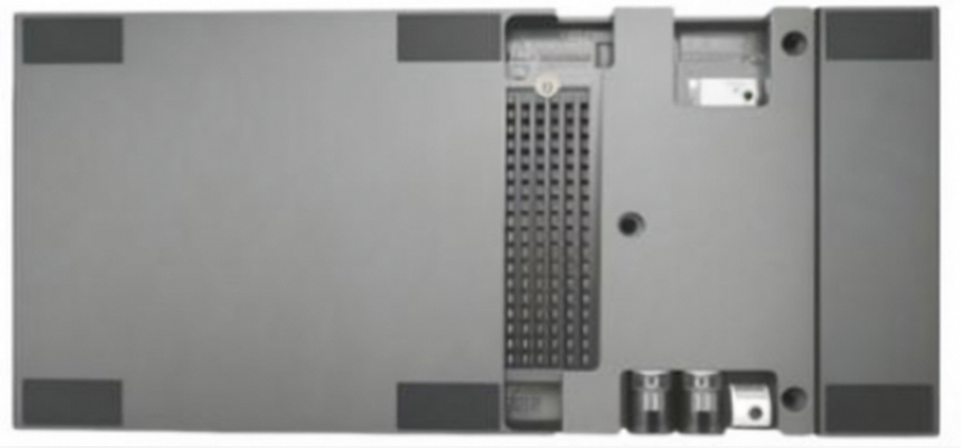

# SENSING Camera Drivers For NVIDIA IGX Devices

SENSING Camera Drivers are developed based on NVIDIA IGX Devices.

Users of SENSING cameras can refer to these drivers to enable camera functionality on NVIDIA IGX Devices.

#### **Supported NVIDIA IGX Devices:**

* **IGX Thor Developer Kit**

    

You can use DownGit to download specified camera driver package folder.

* Enter the path of the driver package folder to download and copy the link address in the browser's address bar
* Open the DownGit (https://minhaskamal.github.io/DownGit/#/home) webpage, and paste the link copied in the previous step into the address input box. Then click the Download button to start the download.